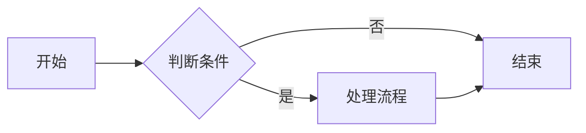
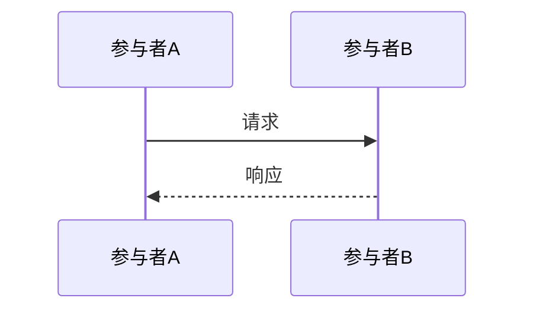

# Markdown 进阶用法和高级用法

在掌握了 Markdown 的基本语法之后，我们可以进一步探索其进阶和高级用法，以实现更丰富和复杂的文本格式化效果。本文将介绍 Markdown 的一些进阶和高级技巧。

## 1. 任务列表

使用 `- [ ]` 和 `- [x]` 创建未完成和已完成的任务列表。

```markdown
- [ ] 任务一：未完成
- [x] 任务二：已完成
```

渲染效果：

- [ ] 任务一：未完成
- [x] 任务二：已完成

## 2. Emoji 表情

Markdown 支持使用 Emoji 表情符号。可以直接输入 Emoji 字符，或者使用 Emoji 代码。

```markdown
Emoji 表情：😄 👍 🎉
Emoji 代码：:smile: :thumbsup: :tada:
```

渲染效果：

Emoji 表情：😄 👍 🎉
Emoji 代码：😄 👍 🎉

常用的 Emoji 代码可以在 [https://www.webfx.com/tools/emoji-cheat-sheet/](https://www.webfx.com/tools/emoji-cheat-sheet/) 找到。

## 3. 脚注

使用 `[^脚注标记]` 创建脚注，然后在文档末尾使用 `[^脚注标记]: 脚注内容` 定义脚注内容。

```markdown
这是一段需要脚注的文本[^1]。

[^1]: 这是脚注的内容。
```

渲染效果：

这是一段需要脚注的文本[^1]。

[^1]: 这是脚注的内容。

## 4. 缩写

使用 `<abbr>` 标签定义缩写及其完整形式。鼠标悬停在缩写上时，会显示完整形式。

```markdown
This is an <abbr title="HyperText Markup Language">HTML</abbr> example.
```

渲染效果：

This is an <abbr title="HyperText Markup Language">HTML</abbr> example.

## 5. 删除线

使用 `~~` 包围文本创建删除线效果。

```markdown
~~这是一段需要删除的文本。~~
```

渲染效果：

~~这是一段需要删除的文本。~~

## 6. 上标和下标

Markdown 本身不直接支持上标和下标，但可以使用 HTML 标签 `<sup>` 和 `<sub>` 实现。

- 上标：

  ```html
  X<sup>2</sup>
  ```

  渲染效果：X<sup>2</sup>

- 下标：

  ```html
  H<sub>2</sub>O
  ```

  渲染效果：H<sub>2</sub>O

## 7. 定义列表

使用 `:` 和 `~` 创建定义列表。

```markdown
Markdown
:   一种轻量级标记语言

HTML
:   超文本标记语言
```

渲染效果：

Markdown
:   一种轻量级标记语言

HTML
:   超文本标记语言

## 8. 自动链接

Markdown 可以自动识别 URL 和邮箱地址并创建链接。

```markdown
URL 自动链接：https://www.google.com
邮箱自动链接：example@example.com
```

渲染效果：

URL 自动链接：https://www.google.com
邮箱自动链接：example@example.com

## 9. HTML 标签

在 Markdown 文档中可以直接嵌入 HTML 标签，以实现更复杂的格式化效果或 Markdown 不支持的功能。

例如，可以使用 `<div>`、`<span>`、`<table>` 等 HTML 标签。

**注意**：过度使用 HTML 标签可能会降低 Markdown 文档的可读性和简洁性，应适度使用。

## 10. 高级表格

Markdown 扩展语法支持更高级的表格功能，例如对齐方式控制。

```markdown
| 左对齐 | 居中对齐 | 右对齐 |
| :----- | :------: | -----: |
| 文本   |   文本   |   文本 |
| 文本   |   文本   |   文本 |
```

渲染效果：

| 左对齐 | 居中对齐 | 右对齐 |
| :----- | :------: | -----: |
| 文本   |   文本   |   文本 |
| 文本   |   文本   |   文本 |

## 11. 流程图和时序图 (需扩展支持)

一些 Markdown 编辑器和平台支持使用特定语法绘制流程图和时序图，例如使用 Mermaid 语法。

### Mermaid 流程图示例

````markdown

````

### Mermaid 时序图示例

````markdown

````

**注意**：流程图和时序图的渲染需要 Markdown 编辑器或平台支持 Mermaid 或其他图表绘制工具。

## 简单应用场景

- **技术文档编写**：使用高级表格、脚注、流程图等功能，编写更专业和详细的技术文档。
- **项目文档**：在项目 README 文件中使用任务列表、Emoji 表情等，提高文档的互动性和可读性。
- **个人博客**：使用 Emoji 表情、缩写、高级表格等，丰富博客文章的表现形式。
- **幻灯片演示**：一些工具可以将 Markdown 文档转换为幻灯片，利用 Markdown 的简洁语法快速制作演示文稿。

掌握 Markdown 的进阶和高级用法，可以更高效地创建更丰富、更专业的文档内容。在实际应用中，可以根据需要选择合适的语法和技巧，提升文档的质量和表达力。
